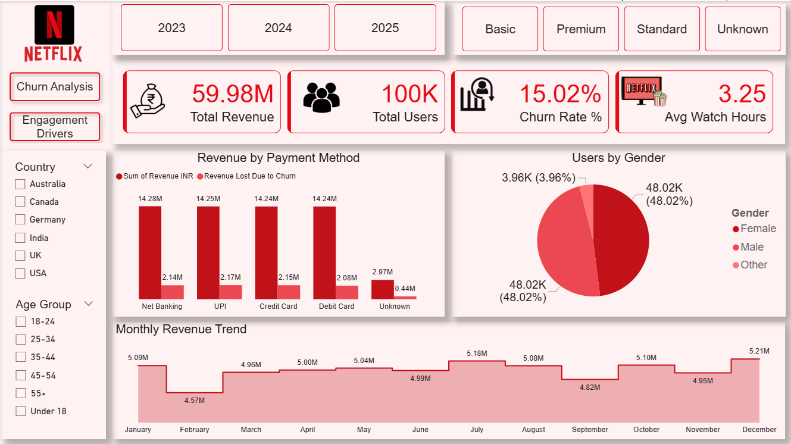

# 📊 Netflix User Behavior & Churn Analysis  
### End-to-End Data Analytics Project (Excel • SQL • Python • Power BI)

An end-to-end data analytics project analyzing **Netflix user behavior, engagement, revenue, and churn** using **Excel, SQL, Python (EDA), and Power BI**.  
This project demonstrates a complete real-world analytics workflow — from raw data cleaning to executive dashboards and business recommendations.

---

## 📸 Dashboard Preview

### 🔹 Executive Overview

### 🔹 Churn Analysis

### 🔹 Revenue & Engagement Deep Dive

---

## 🚀 Project Objective

The goal of this project is to help business stakeholders:

- Understand **user engagement patterns**
- Identify **churn drivers**
- Measure **revenue performance**
- Analyze **subscription plans, payment methods, and devices**
- Provide **actionable insights to reduce churn and increase revenue**

---

## 🛠️ Tools & Technologies

- **Microsoft Excel** – Data cleaning & preprocessing  
- **MySQL** – Business queries & analytics  
- **Python** – Exploratory Data Analysis (EDA)  
  - pandas, numpy, matplotlib, seaborn  
- **Power BI** – Data modeling, DAX & dashboards  
- **DAX** – KPIs & advanced calculations  

---

## 📊 Dataset Overview

The dataset represents Netflix user activity and includes:

- User demographics (Age, Gender, Country)
- Subscription details
- Payment methods
- Devices (Signup vs Viewing)
- Engagement metrics (Watch Hours, Completion %)
- Ratings & customer satisfaction
- Churn indicators
- Revenue information

---

## 🧹 Data Cleaning & Preparation (Excel)

Excel was used as the **foundation layer** to ensure data accuracy before analysis.

### Key Cleaning Steps:
- Removed duplicates and invalid records
- Corrected data types (Age, Revenue, Dates)
- Standardized categorical values
- Created **Age_Group** buckets:
  - 18–24, 25–34, 35–44, 45–54, 55+
- Validated mismatch between age & age categories
- Differentiated:
  - **Signup_Device** → device used to purchase subscription
  - **Viewing_Device** → device used to watch content
- Maintained a **data cleaning log & data dictionary**

📁 Output Files:
- `Netflix_Cleaned_Analytics_File.csv`

---

## 🗄️ SQL Analysis (MySQL)

SQL was used to answer **real business questions** and validate metrics at scale.

### SQL Techniques Used:
- Aggregations (`SUM`, `AVG`, `COUNT`)
- Conditional logic (`CASE WHEN`)
- Common Table Expressions (CTEs)
- Window Functions:
  - `NTILE`, `RANK`, `LAG`
- Revenue & churn calculations
- Time-based trend analysis

### Key Business Queries:
- Total revenue by subscription type
- Churn rate by:
  - Subscription type
  - Payment method
  - Viewing device
- Revenue lost due to churn
- Monthly revenue trends
- Power users identification (Top 5%)
- Engagement by age group & genre

📁 SQL File:
- `Netflix_Database_SQL.sql`

---

## 🐍 Python Exploratory Data Analysis (EDA)

Python was used to perform **deep behavioral analysis** and visualize trends.

### EDA Highlights:
- Data validation & missing value checks
- Revenue distribution analysis
- Watch hours & completion behavior
- Churn vs satisfaction analysis
- Device usage patterns
- Genre-level engagement insights
- Clean, business-friendly visualizations

### Libraries Used:
- pandas
- numpy
- matplotlib
- seaborn

📁 Notebook:
- `Netflix_Data_Analysis.ipynb`

---

## 📈 Power BI Dashboard

A **3-page interactive Power BI dashboard** designed for executives and recruiters.

---

### 📄 Page 1 — Executive Overview

**Purpose:**  
Quick understanding of overall business health.

**KPIs:**
- Total Revenue
- Total Users
- Churn Rate %
- Average Watch Hours

**Visuals:**
- Revenue by Subscription Type
- Users by Gender
- Churn vs Active Users
- Avg Customer Satisfaction by Churn

---

### 📄 Page 2 — Churn Analysis

**Purpose:**  
Identify churn drivers and revenue risk.

**Visuals:**
- Churn Rate by Payment Method
- Revenue Lost Due to Churn
- Churned Users by Genre
- Churn distribution with slicers (Age, Country, Plan)

---

### 📄 Page 3 — Revenue & Engagement Deep Dive

**Purpose:**  
Understand revenue flow and engagement quality.

**Visuals:**
- Monthly Revenue Trend
- Revenue Share by Country
- Engagement patterns by subscription & age
- High-risk segments based on satisfaction & churn

---

## 📊 DAX Measures Used (Sample)

- Total Revenue  
- Total Users  
- Churn Rate %  
- Revenue Lost Due to Churn  
- Avg Watch Hours  
- Avg Customer Satisfaction  
- Churned Users Count  

---

## 🔍 Key Business Insights

- Certain subscription plans show **higher churn risk**
- Specific payment methods contribute disproportionately to churn
- High watch hours with low satisfaction signal **future churn risk**
- A small user segment contributes a large share of revenue
- Revenue trends show clear seasonality

---

## 💡 Business Recommendations

- Improve retention strategies for high-churn payment methods
- Introduce loyalty programs for high-engagement users
- Optimize subscription pricing & benefits
- Improve customer experience to raise satisfaction
- Focus marketing on high-revenue, low-churn segments

---

## 📌 How to Use This Project

1. Review cleaned data in Excel  
2. Explore business logic in SQL scripts  
3. Analyze EDA insights in Python notebook  
4. Open Power BI dashboard for interactive exploration  

---

## 👤 Author

**Sneh Parekh**  
Data Analyst | SQL • Python • Power BI  

---

⭐ If you found this project useful, consider starring the repository!

